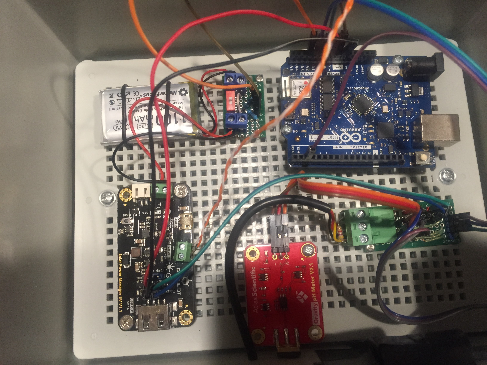
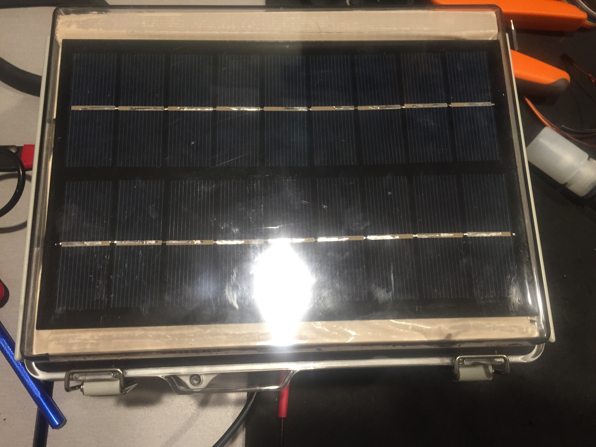

# Pool Monitor

Arduino Project to monitor PH and Temperature as well as outside temperature.  This project is put together from other Arduino Projects as well as some custom stuff that was lacking in the other projects.

## Resources:

**Pool Controller © GPL3+**

https://create.arduino.cc/projecthub/mmackes/pool-controller-8dfa69

**HOW TO SET UP THE DHT11 HUMIDITY SENSOR ON AN ARDUINO**

https://www.circuitbasics.com/how-to-set-up-the-dht11-humidity-sensor-on-an-arduino/

**Safepools.pH © LGPL**

https://create.arduino.cc/projecthub/safepools-ph/safepools-ph-408029

**DIY Benchtop pH Meter © CC BY-NC**

https://create.arduino.cc/projecthub/atlasscientific/diy-benchtop-ph-meter-e94fb4

## COMPONENTS AND SUPPLIES

- 1 x Arduino UNO Wifi Rev 2 ( https://www.amazon.com/gp/product/B07MK598QV/ref=ppx_yo_dt_b_asin_title_o08_s02?ie=UTF8&psc=1 ).
- 2 x E-Projects 10EP5144K70 4.7k Ohm Resistors, 1/4 W, 5% (Pack of 10) (https://www.amazon.com/E-Projects-4-7k-Resistors-Watt-Pieces/dp/B00EV20PF8/ref=sr_1_5?ie=UTF8&qid=1442521134&sr=8-5&keywords=4.7k+resistor&pldnSite=1)
- 1 x HiLetgo 5pcs DHT11 Temperature Humidity Sensor Module Digital Temperature Humidity Sensor 3.3V-5V Humidity Measure Range 20%-95% Temperature Measure Range 0-50℃ Celsius with Dupont Wires ( https://www.amazon.com/gp/product/B01DKC2GQ0/ref=ppx_yo_dt_b_asin_title_o02_s01?ie=UTF8&psc=1 )
- 1 x Consumer Grade pH Probe ( https://atlas-scientific.com/probes/consumer-grade-ph-probe/ )
- 1 x Gratury Junction Box, Hinged Transparent Cover Stainless Steel Clip IP67 Waterproof Plastic Enclosure for Electrical Project Includes Mounting Plate and Wall Bracket 220×170×110mm (8.6"×6.7"×4.3" TC)( https://www.amazon.com/gp/product/B0828387BM/ref=ppx_yo_dt_b_asin_title_o09_s00?ie=UTF8&psc=1 ) 
- Sunnytech 1pc 3w 9v 333ma Mini Solar Panel Module Solar System Solar Epoxy Cell Charger DIY B043 ( https://www.amazon.com/gp/product/B00P4W9UE6/ref=ppx_yo_dt_b_asin_title_o04_s00?ie=UTF8&psc=1 )
- DFROBOT 900mA MPPT Solar Panel Controller - Solar Power Manager Module for 5V Solar Panel - Support Solar and USB Charging ( https://www.amazon.com/gp/product/B07MML4YJV/ref=ppx_yo_dt_b_asin_title_o04_s01?ie=UTF8&psc=1 )
- 4pcs 3.7V 1100mAh Lithium Rechargable Battery 1S 3C Lipo Battery with Protection Board, Insulated Rubber Tape and Micro JST 1.25 Plug for Arduino Nodemcu ESP32 Development Board ( https://www.amazon.com/gp/product/B0867KDMY7/ref=ppx_yo_dt_b_asin_title_o04_s02?ie=UTF8&psc=1 )

## APPS AND ONLINE SERVICES

- Arduino IDE
- DallasTemperature ( https://github.com/milesburton/Arduino-Temperature-Control-Library/blob/master/DallasTemperature.h )

## Schematic

The Solar module and panel was added in version 2 along with a volt meter to monitor the battery status.  The Volt meter circuit has an on and off switch in case you needed to reboot everything without having to take a screw driver to it.  The Volt meter is independent and does not have to be hooked up to the Arduino, it will still pass the needed voltage to the solar module with the option to monitor the voltage from the mater.  Dis can also be disabled in the code by setting the GetVm to false.

## Web UI

There is nothing much to the web ui, it will just display the outside temperature, the outside humidity, the pool temperature and the pH Level.

## End Product

Version 2 of the finished project:

### Inside

### Outside Front

### Outside Bottom

