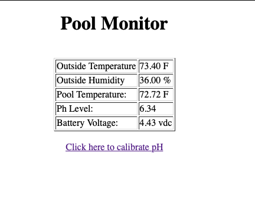

# Pool Monitor

Arduino Project to monitor PH and Temperature as well as outside temperature.  This project is put together from other Arduino Projects as well as some custom stuff that was lacking in the other projects.

## Resources:

**Pool Controller © GPL3+**

https://create.arduino.cc/projecthub/mmackes/pool-controller-8dfa69

**HOW TO SET UP THE DHT11 HUMIDITY SENSOR ON AN ARDUINO**

https://www.circuitbasics.com/how-to-set-up-the-dht11-humidity-sensor-on-an-arduino/

**Safepools.pH © LGPL**

https://create.arduino.cc/projecthub/safepools-ph/safepools-ph-408029

**DIY Benchtop pH Meter © CC BY-NC**

https://create.arduino.cc/projecthub/atlasscientific/diy-benchtop-ph-meter-e94fb4

## COMPONENTS AND SUPPLIES

- 1 x Arduino UNO Wifi
- 2 x E-Projects 10EP5144K70 4.7k Ohm Resistors, 1/4 W, 5% (Pack of 10) (https://www.amazon.com/E-Projects-4-7k-Resistors-Watt-Pieces/dp/B00EV20PF8/ref=sr_1_5?ie=UTF8&qid=1442521134&sr=8-5&keywords=4.7k+resistor&pldnSite=1)
- 1 x Digital Temperature Humidity Sensor Module
- 1 x Consumer Grade pH Probe ( https://atlas-scientific.com/probes/consumer-grade-ph-probe/ )
- 1 x Gravity™ Analog pH Sensor / Meter ( https://atlas-scientific.com/circuits/gravity-analog-ph-sensor-meter/ )

## APPS AND ONLINE SERVICES

- Arduino IDE
- DallasTemperature ( https://github.com/milesburton/Arduino-Temperature-Control-Library/blob/master/DallasTemperature.h )

## Schematic

## Web UI

There is nothing much to the web ui, it will just display the outside temperature, the outside humidity, the pool temperature and the pH Level.

