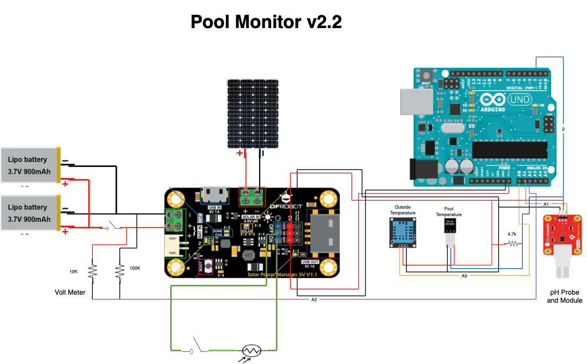

# Pool Monitor

Arduino Project to monitor PH and Temperature as well as outside temperature.  This project is put together from other Arduino Projects as well as some custom stuff that was lacking in the other projects.

## Resources:

**Pool Controller © GPL3+**

https://create.arduino.cc/projecthub/mmackes/pool-controller-8dfa69

**HOW TO SET UP THE DHT11 HUMIDITY SENSOR ON AN ARDUINO**

https://www.circuitbasics.com/how-to-set-up-the-dht11-humidity-sensor-on-an-arduino/

**Safepools.pH © LGPL**

https://create.arduino.cc/projecthub/safepools-ph/safepools-ph-408029

**DIY Benchtop pH Meter © CC BY-NC**

https://create.arduino.cc/projecthub/atlasscientific/diy-benchtop-ph-meter-e94fb4


## COMPONENTS AND SUPPLIES

- 1 x Arduino UNO Wifi Rev 2 ( https://www.amazon.com/gp/product/B07MK598QV/ref=ppx_yo_dt_b_asin_title_o08_s02?ie=UTF8&psc=1 ).
- 2 x E-Projects 10EP5144K70 4.7k Ohm Resistors, 1/4 W, 5% (Pack of 10) (https://www.amazon.com/E-Projects-4-7k-Resistors-Watt-Pieces/dp/B00EV20PF8/ref=sr_1_5?ie=UTF8&qid=1442521134&sr=8-5&keywords=4.7k+resistor&pldnSite=1)
- 1 x HiLetgo 5pcs DHT11 Temperature Humidity Sensor Module Digital Temperature Humidity Sensor 3.3V-5V Humidity Measure Range 20%-95% Temperature Measure Range 0-50℃ Celsius with Dupont Wires ( https://www.amazon.com/gp/product/B01DKC2GQ0/ref=ppx_yo_dt_b_asin_title_o02_s01?ie=UTF8&psc=1 )
- 1 x Atlas Scientific Gravity Analog pH Kit
 ( https://www.amazon.com/gp/product/B07VN8SKR7/ref=ppx_yo_dt_b_search_asin_title?ie=UTF8&psc=1 )
- 1 x Gratury Junction Box, Hinged Transparent Cover Stainless Steel Clip IP67 Waterproof Plastic Enclosure for Electrical Project Includes Mounting Plate and Wall Bracket 220×170×110mm (8.6"×6.7"×4.3" TC)( https://www.amazon.com/gp/product/B0828387BM/ref=ppx_yo_dt_b_asin_title_o09_s00?ie=UTF8&psc=1 ) 
- Sunnytech 1pc 3w 9v 333ma Mini Solar Panel Module Solar System Solar Epoxy Cell Charger DIY B043 ( https://www.amazon.com/gp/product/B00P4W9UE6/ref=ppx_yo_dt_b_asin_title_o04_s00?ie=UTF8&psc=1 )
- DFROBOT 900mA MPPT Solar Panel Controller - Solar Power Manager Module for 5V Solar Panel - Support Solar and USB Charging ( https://www.amazon.com/gp/product/B07MML4YJV/ref=ppx_yo_dt_b_asin_title_o04_s01?ie=UTF8&psc=1 )
- 2pcs 3.7V 1100mAh Lithium Rechargable Battery 1S 3C Lipo Battery with Protection Board, Insulated Rubber Tape and Micro JST 1.25 Plug for Arduino Nodemcu ESP32 Development Board ( https://www.amazon.com/gp/product/B0867KDMY7/ref=ppx_yo_dt_b_asin_title_o04_s02?ie=UTF8&psc=1 )
- 1 x 10K Ohm Resistor - https://www.amazon.com/gp/product/B07QJB31M7/ref=ppx_yo_dt_b_search_asin_title?ie=UTF8&th=1
- 1 x 100k Ohm Resistor - https://www.amazon.com/gp/product/B07QK9793W/ref=ppx_yo_dt_b_search_asin_title?ie=UTF8&psc=1
- 1 x Cylewet 12Pcs 12mm Self-Locking Latching Push Button Switch - https://www.amazon.com/gp/product/B075VBV4QH/ref=ppx_yo_dt_b_search_asin_title?ie=UTF8&psc=1
- 1 x Photoresistor Photo Light Sensitive Resistor Light Dependent - https://www.amazon.com/eBoot-Photoresistor-Sensitive-Resistor-Dependent/dp/B01N7V536K/ref=sr_1_17_sspa?dchild=1&keywords=photocell&qid=1612450238&sr=8-17-spons&psc=1&spLa=ZW5jcnlwdGVkUXVhbGlmaWVyPUEzUkhZTUxIMVk5V0pIJmVuY3J5cHRlZElkPUEwMzA0MjU5M05ETUVQQlc2ODBYMSZlbmNyeXB0ZWRBZElkPUEwOTI5MzI4MTZQUFFKSlBETzBXWCZ3aWRnZXROYW1lPXNwX210ZiZhY3Rpb249Y2xpY2tSZWRpcmVjdCZkb05vdExvZ0NsaWNrPXRydWU=
- 1 x Waterproof Digital Temperature Sensor Single Line Smart Temperature Sensor Probe ( https://www.amazon.com/gp/product/B07VWTFZXC/ref=ppx_yo_dt_b_search_asin_title?ie=UTF8&psc=1 )
- 1 x uxcell 50 Pcs Red DIP Switch 1 Positions for Circuit Breadboards PCB ( https://www.amazon.com/gp/product/B07M9YJKQ6/ref=ppx_yo_dt_b_search_asin_title?ie=UTF8&psc=1 )
- 1 x PCB Board Prototype Board ( https://www.amazon.com/gp/product/B01N3161JP/ref=ppx_yo_dt_b_search_asin_title?ie=UTF8&psc=1 )
- 12 x Brass Standoff / Stainless Steel Screw Nut - Electronics-Salon Metric M2.5 Hex Male-Female Brass Standoff / Stainless Steel Screw Nut Assortment Kit, for Raspberry-Pi. Spacer 6mm 8mm 10mm 12mm 15mm 18mm 20mm 25mm, Nut M2.5, Screw M2.5 x 6mm.
- Jumper Wires ( https://www.amazon.com/gp/product/B08151TQHG/ref=ppx_yo_dt_b_search_asin_title?ie=UTF8&psc=1 )
- HiLetgo 0.96" SSD1306 I2C IIC SPI Serial 128X64 OLED LCD Display 4 Pin Font Color Yellow Blue ( https://www.amazon.com/gp/product/B06XRCQZRX/ref=ppx_yo_dt_b_search_asin_title?ie=UTF8&th=1 ) 
- LeMotech ABS Plastic Junction Box Dustproof Waterproof IP65 Electrical Enclosure Box Universal Project Enclosure Grey with PC Transparent Clear Cover 3.3 x 3.2 x 2.2 inch (83 x 81 x 56 mm) ( https://www.amazon.com/gp/product/B07BPMNCP3/ref=ppx_yo_dt_b_asin_title_o00_s00?ie=UTF8&psc=1 )

## Build Cost

Below is a ruff estimate of the cost of materials to make this  pool monitor, this is not including any type of connectors or special wires that you might want to use to make it pretty or even the type of mounts to secure things in place.  But mostly a cost of all the materials listed above.


## APPS AND ONLINE SERVICES

- Arduino IDE
- DallasTemperature ( https://github.com/milesburton/Arduino-Temperature-Control-Library/blob/master/DallasTemperature.h )

## Schematic



The Solar module and panel was added in version 2 along with a volt meter to monitor the battery status.  The Volt meter circuit has an on and off switch in case you needed to reboot everything without having to take a screw driver to it.  The Volt meter is independent and does not have to be hooked up to the Arduino, it will still pass the needed voltage to the solar module with the option to monitor the voltage from the mater.  Dis can also be disabled in the code by setting the GetVm to false.

Below is the same schematic as shown above, but also includes the option to add a 4 pin LCD Screen.


## Web UI

There is nothing much to the web ui, it will just display the outside temperature, the outside humidity, the pool temperature and the pH Level.


pH Calibration Page


## End Product

Version 2 of the finished project:

### Inside


### Outside Front


### Outside Bottom


# Settings

A majority of the settings can be managed in the Settings.h file.  Here you can adjust settings, or if you wanted to Disable Wifi, or the Display you can do that here.  This is handy if you just wanted to run this on a regular Arduino Uno with the display, then you can disable Wifi, or if you just wanted to run the Wifi with no display, you can disable the display option.

```C++
/*
  General Setttings section to toggle on and off options
*/
#define VERSION "2024.03.25"              //Current Version of Sketch, also related to the release date
#define USE_BIG_TEXT true                 //Use bigger text for display, which will get rid of outside temp and just so pool temp PT and Ph
#define DISPLAYCONNECTED true             // Switch to toggle functions for the LCD Screen if attached.
#define BUGGERME false                    // Enabled Debug Messages
#define USE_WIFI true                     // Enabled or disable the wifi functionality and the webpage
#define webRefresh 60                     // Web Refresh interval
#define GET_OUTSIDE_TEMP true             // Report back the Outside Local Temperature
#define GET_POOL_TEMP true                // Report back on the Pool Temperature
#define GET_PH true                       // Report back on the pH; 
#define GET_BATTERY_VOLTAGE true          // Report back on the battery voltage
#define OutsideTemp A0                    // Analog Pin sensor is connected to
#define SLAVE_ADDRESS 0x40                // Address for dallas module for the I2C
#define SCREEN_WIDTH 128                  // OLED display width, in pixels
#define SCREEN_HEIGHT 64                  // OLED display height, in pixels
#define SCREEN_ADDRESS 0x3C               ///< See datasheet for Address; 0x3D for 128x64, 0x3C for 128x32
```

# Change Log

## v2024.03.22
* Added Option to use a LCD Screen that is attached to the circuit.
* Changed Version to match the release date, also added the version to the command menu
* Refactor WebUI code and put it in it's own class to clean up the Main source.

## v2.2.0.2
* Increased Batter Capacity
* Added Power and Solar Power Switch
* Added OFFLINE for devices that are not hooked up in the webpage.
* Added Option to configure pH meter through the Web UI.